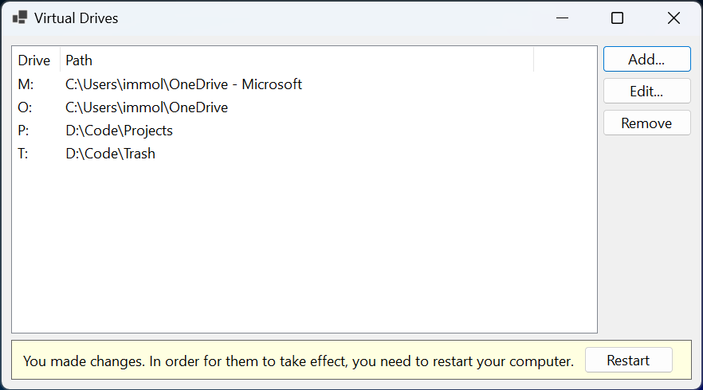

# Virtual Drives

Creates and manages virtual drives in Windows. Should probably be integrated
with [Microsoft PowerToys].

## What are virtual drives?

They are drives that point to directories. So instead of navigating to your
source code by going to `D:\code\Work\MyWorkProject`, you could add a virtual
drive `W:` and navigate to `W:\MyWorkProject`.

I've written about them [in my blog][blog].

[Microsoft PowerToys]: https://github.com/microsoft/PowerToys
[blog]: https://immo.landwerth.net/2021/07/04/subst/